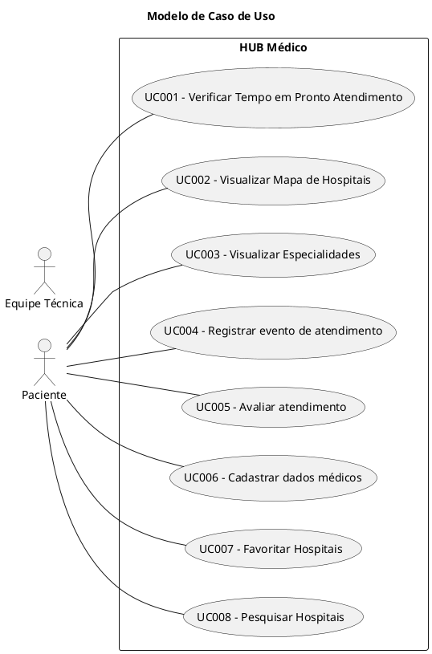
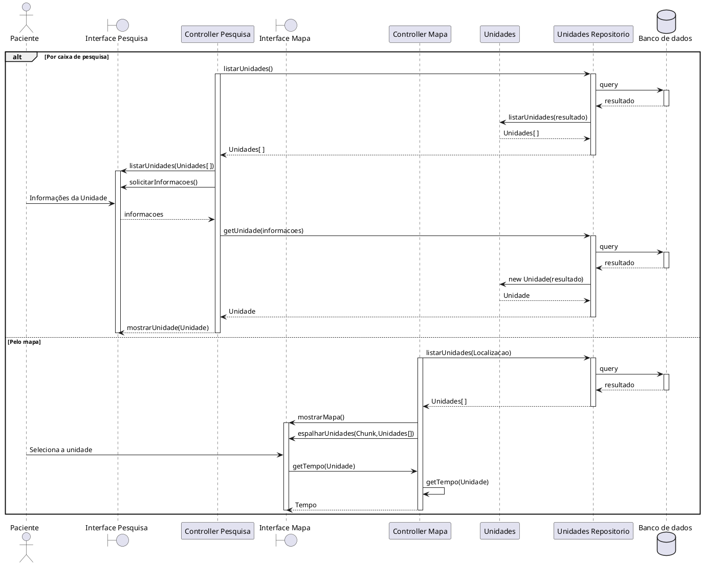
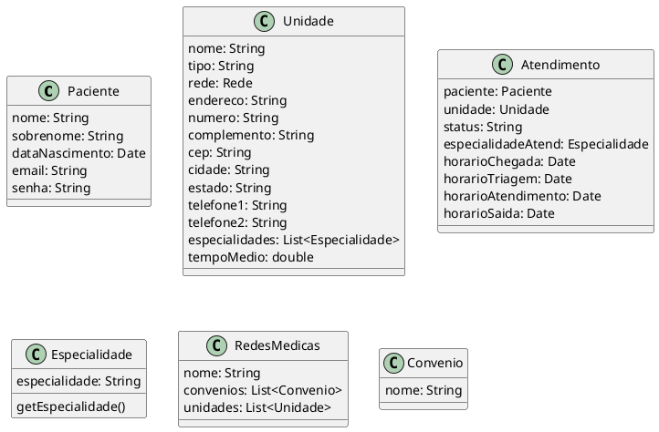
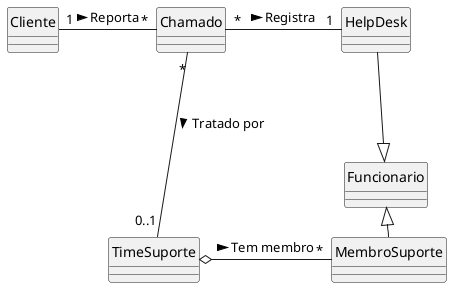

# Casos de Uso

| Nome | Descrição | 
| :--- | :---: | 
| UC001 - Verificar Tempo em Pronto Atendimento | O usuário verifica os hospitais relevantes e o tempo de atendimento em cada |
| UC002 - Visualizar Mapa de Hospitais | O usuário visualiza o mapa da cidade com hospitais mais próximos |
| UC003 - Visualizar Especialidades | O usuário visualiza para cada unidade de atendimento o tempo de espera com base na especialidade desejada | 
| UC004 - Registrar evento de atendimento | O usuário registra o momento de entrada na unidade, a hora da triagem e a hora do atendimento com o especialista | 
| UC005 - Avaliar atendimento | O usuário avalia o atendimento da unidade | 
| UC006 - Cadastrar dados médicos | O usuário salva seus dados médicos |
| UC007 - Favoritar Hospitais | O usuário favorita os hospitais para priorizar visualização |
| UC008 - Pesquisar Hospitais | O usuário visualiza os hospitais da região em formato de lista e pode pesquisá-los por nome |



# Diagrama de sequência do UC001


# Diagrama de Sequência do UC004
```plantuml
@startuml

@enduml
```

# Diagrama de Classe de Domínio



# Escopo do Diagrama de Classe (apenas para salvar formatação)
Exemplo de uma aula do takase para alterar depois com as classes do nosso projeto



