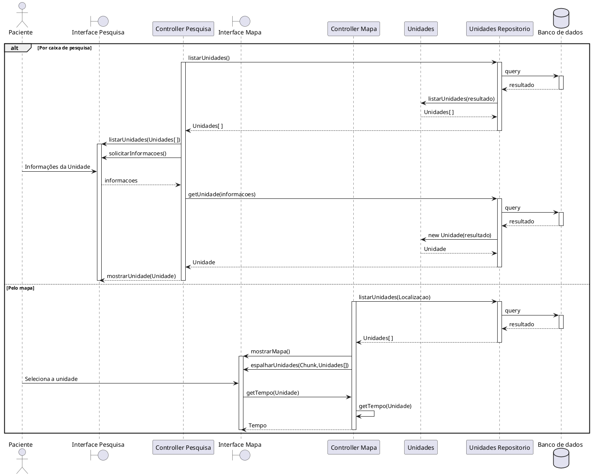

# Especificação de Caso de Uso: UC001

## Informações Gerais

| Campo | Conteúdo |
| :--- | :--- |
| **Identificador** | UC001 |
| **Nome** | Verificar Tempo em Pronto Atendimento |
| **Atores** | Paciente |
| **Sumário** | Permite ao paciente visualizar o tempo médio de espera em unidades de pronto atendimento. |
| **Pré-condição** | A unidade deve ter dados de tempo de atendimento registrados. |
| **Pós-condição** | O paciente visualiza o tempo médio de espera da unidade escolhida. |
| **Pontos de Inclusão** | |
| **Pontos de Extensão** | |

---

## Fluxo Principal

| Ações do Ator | Ações do Sistema |
| :--- | :--- |
| 1. O paciente acessa ao aplicativo. | |
| | 2. O aplicativo exibe a lista de unidades de atendimento. |
| 3. O paciente seleciona uma unidade. | |
| | 4. O aplicativo apresenta o tempo médio de espera da unidade. |

---

## Fluxo Alternativo: Não há avaliações da Unidade

| Ações do Ator | Ações do Sistema |
| :--- | :--- |
| 1. O paciente acessa ao aplicativo. | |
| | 2. O aplicativo exibe a lista de unidades de atendimento. |
| 3. O paciente seleciona uma unidade. | |
| | 4. O aplicativo informa que não há dados registrados, sem estimativa disponível. |

---

# Diagrama de sequência do UC001
