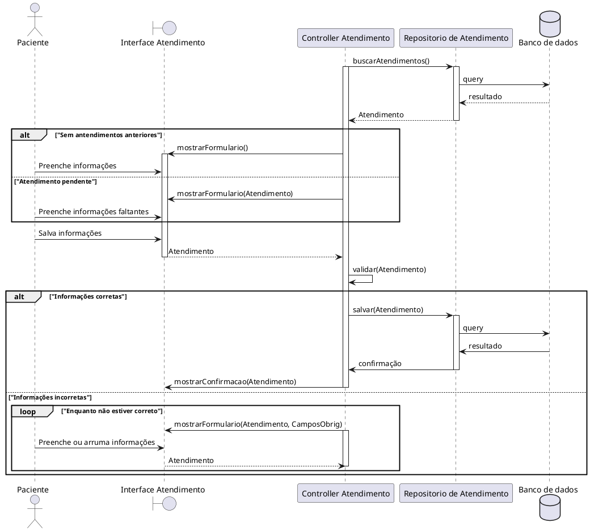

# Especificação de Caso de Uso: UC004

## Informações Gerais

| Campo | Conteúdo |
| :--- | :--- |
| **Identificador** | UC004 |
| **Nome** | Registrar evento de atendimento |
| **Atores** | Paciente |
| **Sumário** | O paciente preenche progressivamente os dados do seu atendimento (hospital, entrada, triagem e atendimento médico), podendo salvar os eventos de forma parcial em momentos distintos. |
| **Pré-condição** | O paciente deve estar autenticado. |
| **Pós-condição** | Os dados do evento de atendimento (parciais ou completos) são validados e armazenados ou atualizados no sistema. |
| **Pontos de Inclusão** | |
| **Pontos de Extensão** | |

---

## Fluxo Principal

| Ações do Ator | Ações do Sistema |
| :--- | :--- |
| 1. O paciente acessa a tela de "Atendimento". | |
| | 2. O sistema identifica se há um atendimento em aberto. Se sim, carrega os dados pré-existentes; caso contrário, exibe um formulário em branco. |
| 3. O paciente insere ou atualiza um ou mais campos disponíveis (Hospital, Horário de Entrada, Horário de Triagem, Horário de Atendimento). | |
| 4. O paciente aciona a opção de salvar. | |
| | 5. O sistema valida se a ordem cronológica dos horários preenchidos está correta (Entrada < Triagem < Atendimento). |
| | 6. O sistema cria ou atualiza o registro no banco de dados e exibe mensagem de confirmação de sucesso. |

---

## Fluxo Alternativo: Conclusão do Atendimento

| Ações do Ator | Ações do Sistema |
| :--- | :--- |
| 1. O paciente preenche o último evento pendente (Horário de Atendimento) de um registro em aberto. | |
| 2. O paciente aciona a opção de salvar. | |
| | 3. O sistema valida os dados e salva as informações. |
| | 4. O sistema altera o status do registro para "Concluído", finalizando o ciclo de edição para aquele evento. |

---

## Fluxo de Exceção 1: Inconsistência Cronológica

| Ações do Ator | Ações do Sistema |
| :--- | :--- |
| | 1. O sistema identifica que o horário de um evento inserido invalida a ordem cronológica com os outros eventos preenchidos. |
| | 2. O aplicativo exibe um alerta de erro de validação temporal. |
| | 3. O sistema interrompe o salvamento e mantém os dados em tela para correção do usuário. |

---

## Fluxo de Exceção 2: Salvamento Sem Dados Mínimos Iniciais

| Ações do Ator | Ações do Sistema |
| :--- | :--- |
| 1. O paciente tenta salvar um novo atendimento sem identificar o Hospital e o Horário de Entrada. | |
| | 2. O sistema sinaliza que estes são campos obrigatórios para a abertura de um novo registro. |
| | 3. A operação de salvamento é interrompida. |

# Diagrama de Sequência UC004
