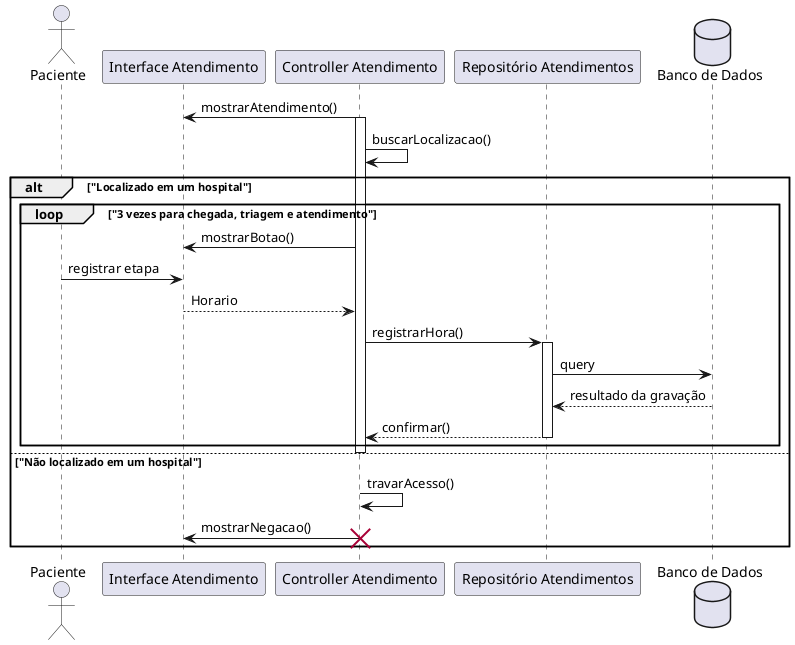

# Especificação de Caso de Uso: UC004

## Informações Gerais

| Campo | Conteúdo |
| :--- | :--- |
| **Identificador** | UC004 |
| **Nome** | Registrar evento de atendimento |
| **Atores** | Paciente |
| **Sumário** | O paciente registra o momento exato de cada etapa do seu atendimento (entrada, triagem e atendimento médico) através de um botão dinâmico na tela de detalhes da unidade, que captura automaticamente o horário do dispositivo. A ação exige que o paciente esteja nas proximidades da unidade. |
| **Pré-condição** | O paciente deve estar autenticado, com o GPS ativado e estar fisicamente próximo à unidade de atendimento. |
| **Pós-condição** | O horário exato capturado do dispositivo para a etapa atual é salvo no sistema e o botão é atualizado para a próxima etapa. |
| **Pontos de Inclusão** | |
| **Pontos de Extensão** | |

---

## Fluxo Principal

| Ações do Ator | Ações do Sistema |
| :--- | :--- |
| 1. O paciente acessa a tela de detalhes da unidade. | |
| | 2. O sistema valida as coordenadas geográficas do paciente em relação à unidade. |
| | 3. O aplicativo exibe o botão de registro com a etapa atual pendente (ex: "Registrar Entrada"). |
| 4. O paciente aciona o botão. | |
| | 5. O sistema captura o horário do dispositivo (horário de máquina). |
| | 6. O sistema envia a marcação para a base de dados. |
| | 7. O sistema exibe uma mensagem de sucesso e altera o texto e o estado do botão para a próxima etapa cronológica (ex: "Registrar Triagem"). |

---

## Fluxo de Exceção 1: Distância Excedida (Geolocalização)

| Ações do Ator | Ações do Sistema |
| :--- | :--- |
| | 1. O sistema verifica as coordenadas do paciente ao carregar a tela de detalhes. |
| | 2. O sistema identifica que o paciente está fora do raio de proximidade permitido para a unidade selecionada. |
| | 3. O aplicativo desabilita o botão de registro. |
| | 4. O aplicativo exibe uma mensagem informando que o registro só pode ser feito nas dependências da unidade de saúde. |

---

## Fluxo de Exceção 2: Falha de Conexão ou Timeout

| Ações do Ator | Ações do Sistema |
| :--- | :--- |
| | 1. O sistema tenta enviar a marcação do horário para a base de dados após o acionamento pelo paciente. |
| | 2. Ocorre uma falha de rede ou timeout durante o envio. |
| | 3. O aplicativo exibe uma mensagem de erro informando que o evento não pôde ser registrado. |
| | 4. O botão mantém o estado original, permitindo que o usuário realize uma nova tentativa. |

# Diagrama de Sequência UC004 Sincrono
