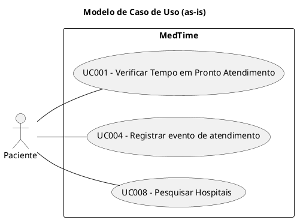
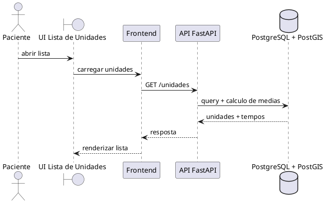

# Casos de Uso (as-is)

| Nome | Descricao | Status |
| :--- | :--- | :--- |
| UC001 - Verificar Tempo em Pronto Atendimento | Lista unidades e exibe tempo medio de espera. | Implementado |
| UC002 - Visualizar Mapa de Hospitais | Mapa com unidades proximas. | Planejado |
| UC003 - Visualizar Especialidades | Especialidades por unidade. | Planejado |
| UC004 - Registrar evento de atendimento | Registro sincronizado de entrada, triagem e atendimento medico com validacao de raio. | Implementado |
| UC005 - Avaliar atendimento | Avaliacao da unidade. | Planejado |
| UC006 - Cadastrar dados medicos | Cadastro de dados medicos do paciente. | Planejado |
| UC007 - Favoritar Hospitais | Favoritos no frontend. | Planejado (UI parcial) |
| UC008 - Pesquisar Hospitais | Busca textual na lista de unidades. | Implementado |

# Diagrama de sequencia do UC001 (simplificado)

Detalhes completos em [docs/UC001.md](UC001.md), [docs/UC004_input_sincrono.md](UC004_input_sincrono.md) e [docs/UC008.md](UC008.md).
