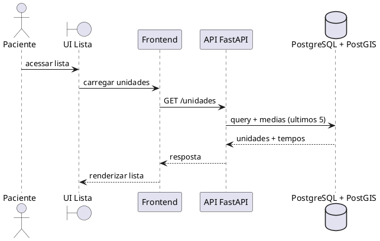

# Especificacao de Caso de Uso: UC001

## Informações Gerais

| Campo | Conteúdo |
| :--- | :--- |
| **Identificador** | UC001 |
| **Nome** | Verificar Tempo em Pronto Atendimento |
| **Atores** | Paciente |
| **Sumario** | Permite ao paciente visualizar o tempo medio de espera em unidades de pronto atendimento. |
| **Pre-condicao** | A base possui unidades cadastradas e atendimentos suficientes para calculo de medias. |
| **Pos-condicao** | O paciente visualiza a lista de unidades com tempo medio de espera e, quando aplicavel, distancia. |
| **Pontos de Inclusão** | |
| **Pontos de Extensão** | |

---

## Fluxo Principal

| Acoes do Ator | Acoes do Sistema |
| :--- | :--- |
| 1. O paciente acessa ao aplicativo. | |
| | 2. O aplicativo requisita a lista de unidades. |
| | 3. O backend calcula o tempo medio com base nos ultimos 5 atendimentos por unidade. |
| | 4. O aplicativo exibe a lista com tempo medio e, se disponivel, distancia. |

---

## Fluxo Alternativo: Sem dados suficientes

| Acoes do Ator | Acoes do Sistema |
| :--- | :--- |
| 1. O paciente acessa ao aplicativo. | |
| | 2. O aplicativo exibe a lista de unidades de atendimento. |
| | 3. Quando nao ha dados suficientes, o tempo medio retorna como 0 e a UI pode indicar "sem dados". |

---

# Diagrama de sequencia do UC001 (simplificado)
