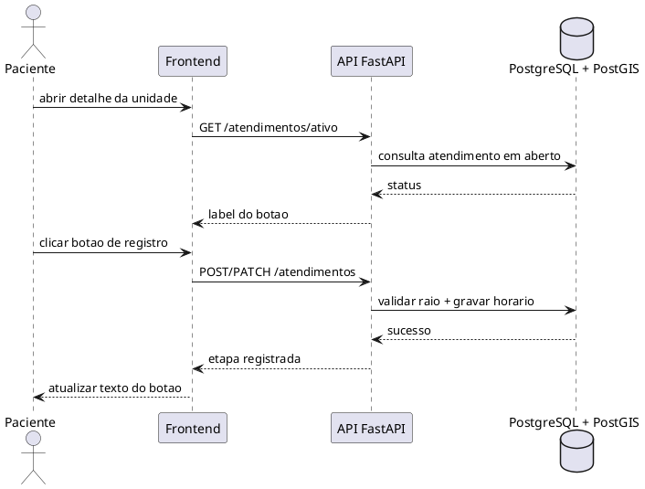

# Especificacao de Caso de Uso: UC004

## Informações Gerais

| Campo | Conteúdo |
| :--- | :--- |
| **Identificador** | UC004 |
| **Nome** | Registrar evento de atendimento |
| **Atores** | Paciente |
| **Sumario** | O paciente registra as etapas do atendimento (entrada, triagem e atendimento medico) por um botao dinamico na tela da unidade. |
| **Pre-condicao** | Paciente e unidade existentes e usuario dentro do raio permitido (2 km). |
| **Pos-condicao** | O horario da etapa atual e registrado e o estado do botao avanca para a proxima etapa. |
| **Pontos de Inclusão** | |
| **Pontos de Extensão** | |

---

## Fluxo Principal

| Acoes do Ator | Acoes do Sistema |
| :--- | :--- |
| 1. O paciente acessa a tela de detalhes da unidade. | |
| | 2. O sistema consulta o atendimento ativo e define o texto do botao (Entrada, Triagem, Atendimento medico). |
| | 3. O sistema valida a proximidade do usuario em relacao a unidade. |
| 4. O paciente aciona o botao de registro. | |
| | 5. O backend grava o horario atual da etapa e retorna sucesso. |
| | 6. O botao passa para a proxima etapa. |

---

## Fluxo Alternativo: Conclusao do Atendimento

| Acoes do Ator | Acoes do Sistema |
| :--- | :--- |
| 1. O paciente registra a ultima etapa (atendimento medico). | |
| | 2. O sistema grava o horario e marca o atendimento como concluido. |

---

## Fluxo de Excecao 1: Distancia excedida

| Acoes do Ator | Acoes do Sistema |
| :--- | :--- |
| | 1. O sistema identifica que o usuario esta fora do raio permitido. |
| | 2. O aplicativo bloqueia o botao e informa a restricao. |

---

## Fluxo de Excecao 2: Falha de conexao

| Acoes do Ator | Acoes do Sistema |
| :--- | :--- |
| | 1. O sistema falha ao registrar o horario por indisponibilidade de rede ou API. |
| | 2. O aplicativo exibe mensagem de erro e mantem o estado do botao para nova tentativa. |

# Diagrama de Sequencia UC004 (sincrono)
