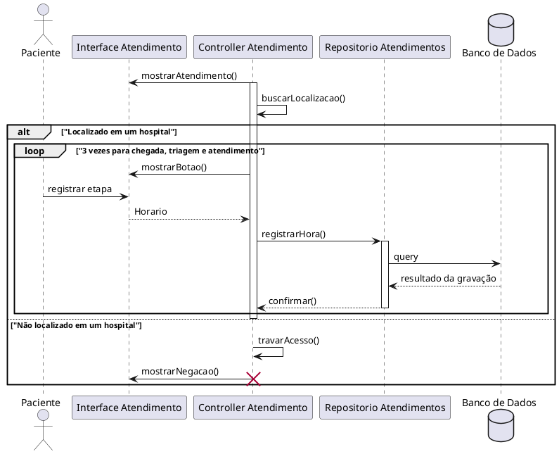

# Especificacao de Caso de Uso: UC004 (input sincrono)

## Informações Gerais

| Campo | Conteúdo |
| :--- | :--- |
| **Identificador** | UC004 |
| **Nome** | Registrar evento de atendimento |
| **Atores** | Paciente |
| **Sumario** | O paciente registra o momento exato de cada etapa do atendimento por um botao dinamico que captura o horario do dispositivo. |
| **Pre-condicao** | Paciente e unidade existentes, GPS disponivel e usuario dentro do raio permitido (2 km). |
| **Pos-condicao** | O horario da etapa atual e salvo e o botao e atualizado para a proxima etapa. |
| **Pontos de Inclusão** | |
| **Pontos de Extensão** | |

---

## Fluxo Principal

| Acoes do Ator | Acoes do Sistema |
| :--- | :--- |
| 1. O paciente acessa a tela de detalhes da unidade. | |
| | 2. O sistema valida as coordenadas geograficas do paciente em relacao a unidade. |
| | 3. O aplicativo exibe o botão de registro com a etapa atual pendente (ex: "Registrar Entrada"). |
| 4. O paciente aciona o botão. | |
| | 5. O sistema captura o horário do dispositivo (horário de máquina). |
| | 6. O sistema envia a marcacao para a base de dados via API. |
| | 7. O sistema exibe sucesso e altera o texto do botao para a proxima etapa (ex: "Registrar Triagem"). |

---

## Fluxo de Excecao 1: Distancia excedida (geolocalizacao)

| Acoes do Ator | Acoes do Sistema |
| :--- | :--- |
| | 1. O sistema verifica as coordenadas do paciente ao carregar a tela de detalhes. |
| | 2. O sistema identifica que o paciente está fora do raio de proximidade permitido para a unidade selecionada. |
| | 3. O aplicativo desabilita o botao de registro. |
| | 4. O aplicativo exibe mensagem informando que o registro so pode ser feito nas dependencias da unidade. |

---

## Fluxo de Excecao 2: Falha de conexao ou timeout

| Acoes do Ator | Acoes do Sistema |
| :--- | :--- |
| | 1. O sistema tenta enviar a marcação do horário para a base de dados após o acionamento pelo paciente. |
| | 2. Ocorre uma falha de rede ou timeout durante o envio. |
| | 3. O aplicativo exibe uma mensagem de erro informando que o evento nao pode ser registrado. |
| | 4. O botao mantem o estado original, permitindo nova tentativa. |

# Diagrama de Sequencia UC004 Sincrono
