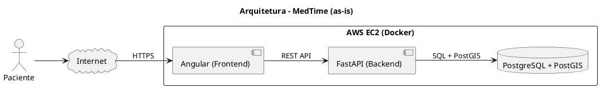

# Arquitetura - MedTime (as-is)

O projeto e executado localmente via Docker Compose e, no deploy alvo, em uma unica instancia EC2 contendo frontend, backend e banco no mesmo host. O frontend consome a API via HTTP e o backend acessa o banco PostGIS para consultas geoespaciais.

