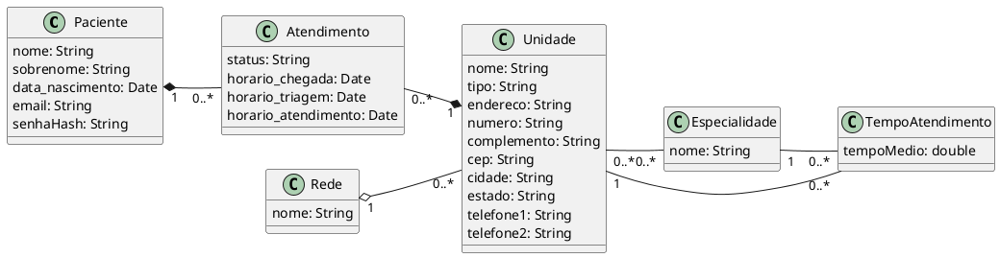

# Diagrama de Classe de Domínio

```plantuml
@startuml
left to right direction

class Paciente {
    nome: String
    sobrenome: String
    data_nascimento: Date
    email: String
    senhaHash: String
}

class Atendimento {
    status: String
    horario_chegada: Date
    horario_triagem: Date
    horario_atendimento: Date
}

class Unidade {
    nome: String
    tipo: String
    endereco: String
    numero: String
    complemento: String
    cep: String
    cidade: String
    estado: String
    telefone1: String
    telefone2: String
}

class Especialidade {
    nome: String
}

class Rede {
    nome: String
}

class TempoAtendimento {
    tempoMedio: double
}

Paciente "1" *-- "0..*" Atendimento
Unidade "1" *-- "0..*" Atendimento

Rede "1" o-- "0..*" Unidade

Unidade "0..*" -- "0..*" Especialidade

Unidade "1" -- "0..*" TempoAtendimento
Especialidade "1" -- "0..*" TempoAtendimento

Paciente -[hidden]-> Atendimento
Atendimento -[hidden]-> Unidade
Unidade -[hidden]-> Especialidade

Rede -[hidden]-> Unidade
Especialidade -[hidden]-> TempoAtendimento

@enduml
```