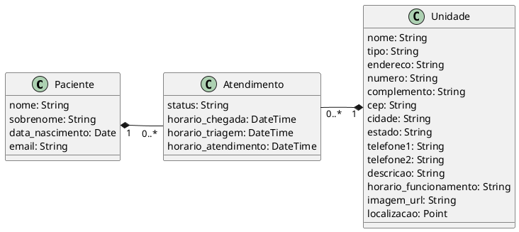

# Diagrama de Classe de Dominio (as-is)

```plantuml
@startuml
left to right direction

class Paciente {
    nome: String
    sobrenome: String
    data_nascimento: Date
    email: String
}

class Atendimento {
    status: String
    horario_chegada: DateTime
    horario_triagem: DateTime
    horario_atendimento: DateTime
}

class Unidade {
    nome: String
    tipo: String
    endereco: String
    numero: String
    complemento: String
    cep: String
    cidade: String
    estado: String
    telefone1: String
    telefone2: String
    descricao: String
    horario_funcionamento: String
    imagem_url: String
    localizacao: Point
}

Paciente "1" *-- "0..*" Atendimento
Unidade "1" *-- "0..*" Atendimento

Paciente -[hidden]-> Atendimento
Atendimento -[hidden]-> Unidade
@enduml
```